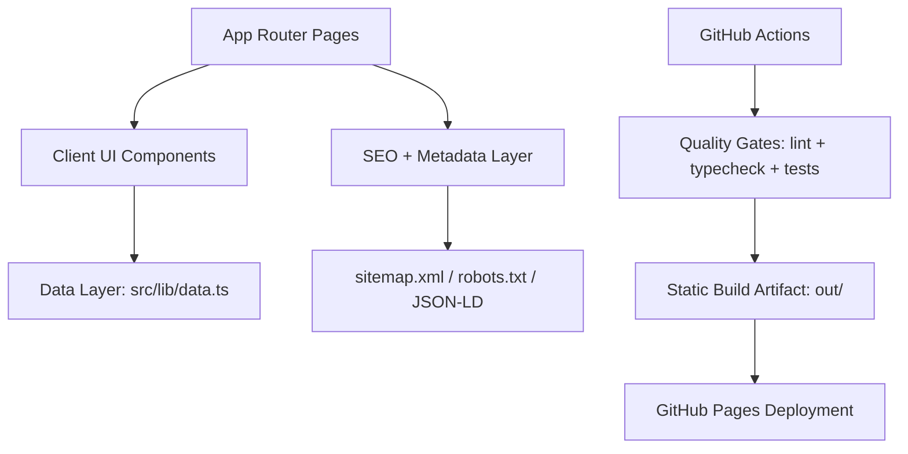

# Mohammad Raouf Abedini Portfolio

Production-grade Next.js portfolio website for showcasing cybersecurity engineering projects, write-ups, and lab experiments.

[Live Site](https://raoof128.github.io/Portfolio) · [Security Policy](./SECURITY.md) · [Architecture](./docs/ARCHITECTURE.md) · [API/Data Reference](./docs/API_REFERENCE.md)

## Highlights

- Next.js App Router with static export for GitHub Pages.
- Strict TypeScript, ESLint, and Vitest test suite.
- Security-first content and disclosure workflow (`security.txt`, Hall of Fame, policy page).
- Reusable UI system with animation primitives and responsive layouts.
- Structured project/write-up/lab data model powering dynamic static routes.

## Tech Stack

- Framework: Next.js 16, React 19, TypeScript
- Styling: Tailwind CSS 4
- Motion/UI: Framer Motion, Lucide React
- Testing: Vitest + React Testing Library + jsdom
- CI/CD: GitHub Actions (CI + Pages deploy)

## Architecture



Detailed design notes are documented in [docs/ARCHITECTURE.md](./docs/ARCHITECTURE.md).

## Repository Structure

```text
.
├── .github/workflows/        # CI and deployment automation
├── docs/                     # Architecture and project references
├── public/                   # Static assets + security.txt + llms.txt
├── src/
│   ├── app/                  # Route segments and metadata routes
│   ├── components/           # UI and layout components
│   ├── lib/                  # Constants, data model, utility functions
│   └── test/                 # Test setup
├── AGENT.md                  # Local AI assistant governance
├── CHANGELOG.md              # Change history
├── SECURITY.md               # Vulnerability disclosure process
└── README.md
```

## Local Development

### Prerequisites

- Node.js `20.x` (see [`.nvmrc`](./.nvmrc))
- npm `10+`

### Setup

```bash
git clone https://github.com/Raoof128/Portfolio.git
cd Portfolio
npm ci
npm run dev
```

Open `http://localhost:3000/Portfolio`.

## Quality Commands

```bash
npm run lint
npm run typecheck
npm run test:ci
npm run build
```

## Deployment

This repository is configured for GitHub Pages static hosting:

- `next.config.ts` uses `output: "export"` and `basePath: "/Portfolio"`.
- Deployments run from `.github/workflows/deploy.yml` on pushes to `main`.
- PR and branch quality checks run from `.github/workflows/ci.yml`.

## Security

- Responsible disclosure: [SECURITY.md](./SECURITY.md)
- RFC 9116 contact file: [public/security.txt](./public/security.txt)
- Hall of Fame: `/hall-of-fame`

## Documentation Index

- [Architecture](./docs/ARCHITECTURE.md)
- [API/Data Reference](./docs/API_REFERENCE.md)
- [Mehr Guard Notes](./docs/MEHR_GUARD_README.md)
- [GitSwitch Notes](./docs/GITSWITCH_README.md)
- [ECRSM Notes](./docs/ECRSM_README.md)

## Contributing and License

- Contributing guide: [CONTRIBUTING.md](./CONTRIBUTING.md)
- Code of conduct: [CODE_OF_CONDUCT.md](./CODE_OF_CONDUCT.md)
- License: [MIT](./LICENSE)
