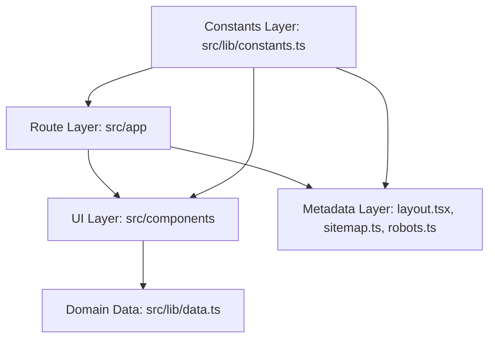

# Portfolio Architecture Overview

## 1. System Goals

- Serve a fast, static, publicly accessible portfolio website.
- Keep data centralized and strongly typed.
- Preserve security and SEO metadata as first-class concerns.
- Enforce repeatable quality gates before deployment.

## 2. Runtime Model

This application is built with Next.js App Router and exported as static files for GitHub Pages.


No server-side runtime API is required for production delivery.

## 3. Application Layers



### Route Layer (`src/app`)

- Defines page routes (`/`, `/projects`, `/lab`, `/write-ups`, etc.).
- Uses static params for dynamic segments (`[slug]`, `[id]`) to guarantee export-safe routing.
- Exposes SEO metadata via `metadata`, `generateMetadata`, `sitemap`, and `robots`.

### UI Layer (`src/components`)

- Layout primitives: `Navbar`, `Footer`.
- Reusable UI primitives: `NeonButton`, `HUDFrame`, `ProjectCard`, animation components.
- Route-specific client components render presentation and interactions.

### Data Layer (`src/lib/data.ts`)

- Single source of truth for:
  - Projects
  - Write-ups
  - Lab experiments
- Strong TypeScript interfaces ensure route and component consistency.

### Constants Layer (`src/lib/constants.ts`)

- Centralizes canonical URLs and contact metadata.
- Prevents drift in structured metadata, sitemap, and UI links.

## 4. Security and SEO Design

- `SECURITY.md` + `public/security.txt` define disclosure and contact paths.
- JSON-LD Person schema is injected in root layout.
- Canonical URL + sitemap + robots are generated from shared constants.
- External links use `rel="noopener noreferrer"` where appropriate.

## 5. Testing Strategy

- Unit tests for data model and utility behavior.
- Component tests for navigation, project cards, buttons, and footer.
- Form behavior tests for contact form validation and state transitions.

Quality commands:

```bash
npm run lint
npm run typecheck
npm run test:ci
npm run build
```

## 6. Delivery Pipeline

- CI workflow validates lint, types, tests, and production build.
- Deploy workflow publishes static `out/` artifact to GitHub Pages.

## 7. Key Tradeoffs

- Static export maximizes reliability and reduces attack surface, but avoids runtime backend features.
- Content is source-controlled for consistency, but requires code changes for content updates.
- Animation-rich UI is intentionally used, balanced by reusable primitives and test coverage.
